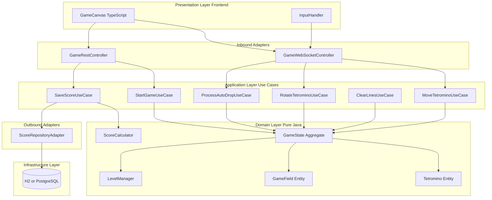
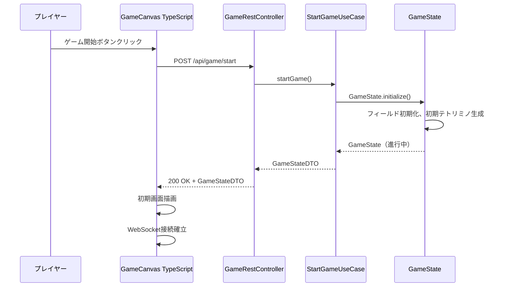
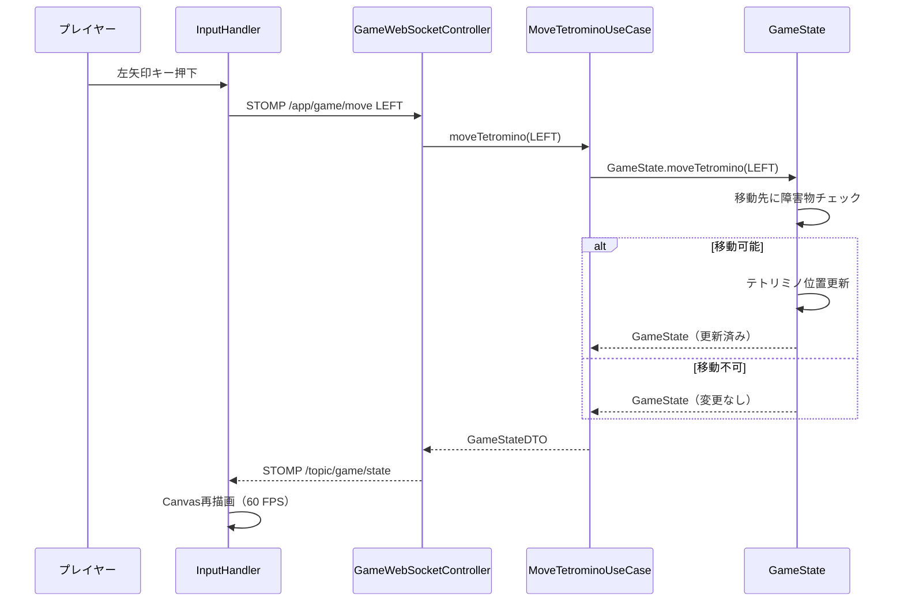
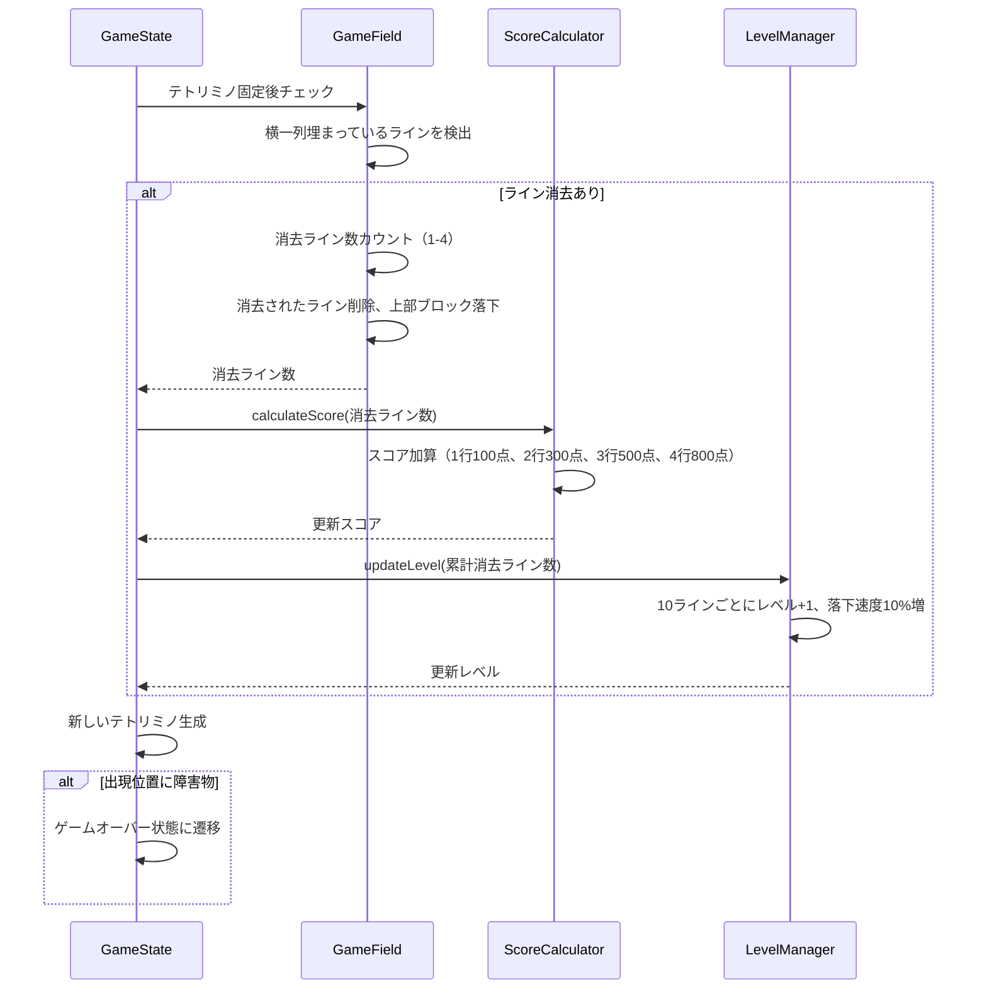
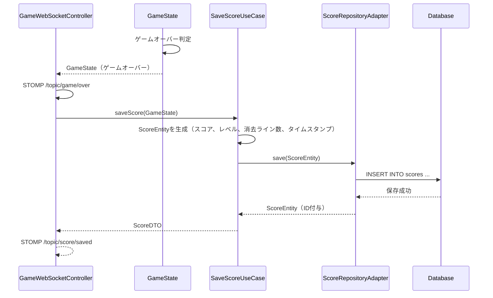
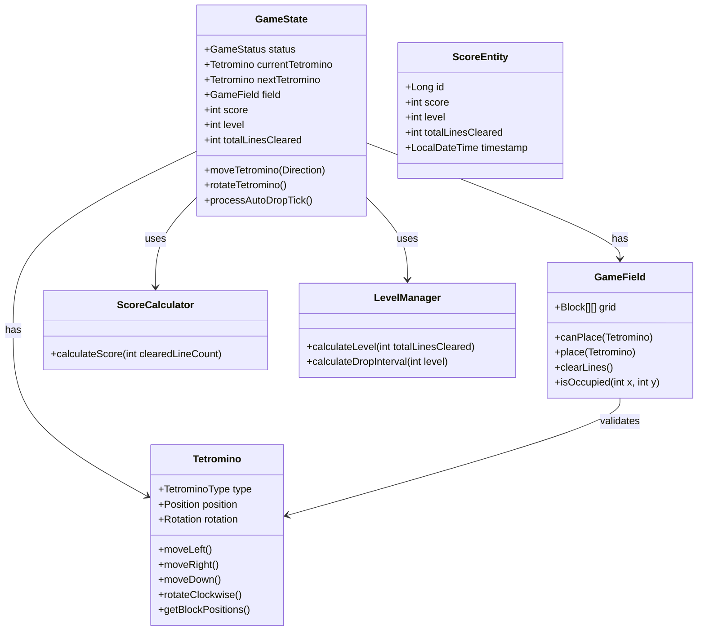

# Design Document

## Overview

本機能は、Java + Spring Bootフレームワークとオニオンアーキテクチャを採用したテトリスWebアプリケーションを提供します。クラシックなテトリスゲーム体験をブラウザで実現し、プレイヤーはテトリミノの操作、ライン消去、スコア獲得を通じてゲームを楽しむことができます。

**Purpose**: ブラウザベースのテトリスゲームを通じて、保守性と拡張性の高いオニオンアーキテクチャの実装例を提供し、プレイヤーに快適なゲーム体験を届ける

**Users**: 一般プレイヤーは、Webブラウザ（デスクトップPC）でゲームをプレイし、スコアを記録・確認する。開発者は、オニオンアーキテクチャの実装パターンを学習する

**Impact**: 既存システムはなく、新規にゲームアプリケーションを構築する

### Goals

- クラシックテトリスのゲームプレイ実装（テトリミノ操作、自動落下、ライン消去、スコア計算）
- オニオンアーキテクチャ（ヘキサゴナルアーキテクチャ）による明確な層分離
- 100ms以内の操作レスポンスタイムと60 FPS描画の実現
- スコア履歴の永続化と表示
- 単体テストカバレッジ80%以上の達成

### Non-Goals

- モバイルブラウザ対応（PCデスクトップブラウザのみ）
- マルチプレイヤー機能（シングルプレイのみ）
- ユーザー認証・アカウント管理（匿名プレイ、スコアのみ保存）
- ゲームモードのバリエーション（クラシックモードのみ）
- リアルタイムランキング機能（ローカルスコア履歴のみ）

## Architecture

### Architecture Pattern & Boundary Map

**アーキテクチャパターン選定**: Hexagonal Architecture (Ports & Adapters)

ヘキサゴナルアーキテクチャは、ドメインロジックを外部システム（UI、データベース、外部サービス）から分離し、ポート（インターフェース）とアダプター（実装）でつなぐ設計パターンです。Requirement 8のオニオンアーキテクチャ要件と一致します。



**Architecture Integration**:
- **選定パターン**: Hexagonal Architecture（別名：Ports & Adapters、Onion Architecture）— ドメインロジックを中心に配置し、外部システムを交換可能なアダプターとして扱う
- **ドメイン/機能境界**:
  - **Domain Layer**: ゲームロジック（テトリミノ、フィールド、スコア、レベル）を純粋Javaで実装。外部依存ゼロ
  - **Application Layer**: ユースケース（移動、回転、ライン消去、スコア保存）を定義。ドメインを呼び出すオーケストレーション
  - **Adapter Layer（Inbound）**: REST APIとWebSocketでUI/フロントエンドと接続
  - **Adapter Layer（Outbound）**: データベースリポジトリでスコア永続化
  - **Presentation Layer**: TypeScript + HTML5 Canvasでゲーム画面描画とユーザー入力処理
- **既存パターンの維持**: 新規プロジェクトのため該当なし
- **新規コンポーネントの根拠**:
  - `GameState`: ゲームの状態（進行中/ゲームオーバー、現在のテトリミノ、フィールド状態）を集約するルートエンティティ
  - `Tetromino`: 7種類のテトリミノ（I, O, T, S, Z, J, L）を表現し、回転・移動ロジックを内包
  - `GameField`: 10×20のフィールド状態管理、衝突判定、ライン消去ロジック
  - `WebSocketController`: リアルタイム操作（100ms以内のレスポンス要件）のため
- **ステアリング準拠**: ステアリングディレクトリが空のため該当原則なし。一般的なヘキサゴナルアーキテクチャ原則を適用

### Technology Stack

| Layer | Choice / Version | Role in Feature | Notes |
|-------|------------------|-----------------|-------|
| Frontend | TypeScript 5.x + HTML5 Canvas | ゲーム画面描画、ユーザー入力処理、60 FPS描画 | Canvas 2Dコンテキストで図形描画。`requestAnimationFrame`で60 FPS実現 |
| Backend | Java 17 + Spring Boot 3.3.x | ゲームロジック実行、REST API提供、WebSocket通信 | Java 17のRecords、Sealed Classesで型安全性向上 |
| Web Framework | Spring Web MVC + Spring WebSocket | REST API（ゲーム開始、スコア保存）、WebSocket（リアルタイム操作） | STOMP over WebSocketで双方向通信 |
| Data Access | Spring Data JPA 3.x | スコアエンティティの永続化、履歴取得 | JPAでDB非依存の実装 |
| Database (Dev/Test) | H2 Database 2.x（組み込み） | 開発・テスト環境での簡易セットアップ | インメモリモードで起動高速化 |
| Database (Prod) | PostgreSQL 15.x | 本番環境での信頼性・パフォーマンス | Spring Profilesで切り替え |
| Build Tool | Gradle 8.x | ビルド、依存関係管理、TypeScriptトランスパイル統合 | Requirement 9で指定 |
| Testing | JUnit 5 + Mockito + Spring Boot Test | 単体テスト、統合テスト | JaCoCoでカバレッジ80%目標 |

**技術選定の根拠**（詳細は`research.md`参照）:
- **TypeScript**: 型安全性によりフロントエンド開発時のエラー早期検出。Javaの型システムと設計思想一致
- **WebSocket**: REST APIのPollingと比較し、低レイテンシ（100ms以内要件）を実現。双方向通信でユーザー操作を即座にサーバー送信
- **Java 17 Records**: イミュータブルなドメインエンティティ（Tetromino、Score）を簡潔に定義
- **Spring Boot 3**: Jakarta EE 11ベースライン、WebSocket 2.2サポート、JSpecify null安全性

## System Flows

### ゲーム開始フロー



### テトリミノ移動・回転フロー（WebSocketリアルタイム）



### ライン消去とスコア計算フロー



### ゲームオーバーとスコア保存フロー



**フロー設計のポイント**:
- REST APIはゲーム開始とスコア履歴取得に使用（ステートレス操作）
- WebSocketはリアルタイム操作（移動、回転、自動落下）に使用（低レイテンシ）
- ドメインロジック（移動判定、ライン消去、スコア計算）は純粋Javaで実装

## Requirements Traceability

| Requirement | Summary | Components | Interfaces | Flows |
|-------------|---------|------------|------------|-------|
| 1.1-1.7 | テトリミノ操作（移動、回転） | MoveTetrominoUseCase, RotateTetrominoUseCase, GameState, Tetromino | GameWebSocketController, Tetromino.move(), Tetromino.rotate() | テトリミノ移動・回転フロー |
| 2.1-2.5 | テトリミノ自動落下 | ProcessAutoDropUseCase, GameState, Tetromino | GameWebSocketController, Tetromino.drop() | ライン消去とスコア計算フロー |
| 3.1-3.7 | ライン消去とスコア | ClearLinesUseCase, GameField, ScoreCalculator | GameField.clearLines(), ScoreCalculator.calculate() | ライン消去とスコア計算フロー |
| 4.1-4.5 | レベルと難易度 | LevelManager, GameState | LevelManager.updateLevel(), GameState.getDropInterval() | ライン消去とスコア計算フロー |
| 5.1-5.4 | ゲームオーバーと再スタート | GameState, StartGameUseCase | GameRestController POST /api/game/start | ゲーム開始フロー、ゲームオーバーとスコア保存フロー |
| 6.1-6.6 | ゲーム画面UI | GameCanvas, GameStateRenderer, InputHandler | Canvas 2D API, KeyboardEvent | テトリミノ移動・回転フロー |
| 7.1-7.4 | スコア保存 | SaveScoreUseCase, ScoreRepositoryAdapter, ScoreEntity | GameRestController GET /api/scores, ScoreRepository.save() | ゲームオーバーとスコア保存フロー |
| 8.1-8.6 | オニオンアーキテクチャ | Domain Layer, Application Layer, Adapter Layer | ポート（インターフェース）、アダプター（実装） | 全フロー |
| 9.1-9.6 | Spring Boot実装 | Spring Boot, Spring Data JPA, Spring Web, Gradle | ApplicationContext, JpaRepository, RestController | 全フロー |
| 10.1-10.6 | 非機能要件 | すべてのコンポーネント | WebSocket（低レイテンシ）、requestAnimationFrame（60 FPS） | 全フロー |

## Components and Interfaces

### コンポーネント概要

| Component | Domain/Layer | Intent | Req Coverage | Key Dependencies (P0/P1) | Contracts |
|-----------|--------------|--------|--------------|--------------------------|-----------|
| Tetromino | Domain | テトリミノの状態と操作ロジック | 1, 2 | なし（Pure Java） | Service |
| GameField | Domain | フィールド状態、衝突判定、ライン消去 | 1, 2, 3 | Tetromino (P0) | Service |
| GameState | Domain | ゲーム状態の集約ルート | 1, 2, 3, 4, 5 | Tetromino (P0), GameField (P0), LevelManager (P0) | Service |
| ScoreCalculator | Domain | スコア計算ロジック | 3 | なし（Pure Java） | Service |
| LevelManager | Domain | レベルと難易度管理 | 4 | なし（Pure Java） | Service |
| StartGameUseCase | Application | ゲーム開始ユースケース | 5 | GameState (P0) | Service |
| MoveTetrominoUseCase | Application | テトリミノ移動ユースケース | 1 | GameState (P0) | Service |
| RotateTetrominoUseCase | Application | テトリミノ回転ユースケース | 1 | GameState (P0) | Service |
| ProcessAutoDropUseCase | Application | 自動落下処理ユースケース | 2 | GameState (P0) | Service |
| ClearLinesUseCase | Application | ライン消去ユースケース | 3 | GameState (P0), ScoreCalculator (P0) | Service |
| SaveScoreUseCase | Application | スコア保存ユースケース | 7 | ScoreRepositoryPort (P0) | Service |
| GameRestController | Adapter (Inbound) | REST APIエンドポイント | 5, 7 | StartGameUseCase (P0), SaveScoreUseCase (P0) | API |
| GameWebSocketController | Adapter (Inbound) | WebSocketエンドポイント | 1, 2, 3, 4 | MoveTetrominoUseCase (P0), RotateTetrominoUseCase (P0), ProcessAutoDropUseCase (P0) | API, Event |
| ScoreRepositoryAdapter | Adapter (Outbound) | データベースアクセス | 7 | JpaRepository (P0) | Service |
| GameCanvas | Presentation (Frontend) | ゲーム画面描画 | 6 | GameStateRenderer (P0) | State |
| InputHandler | Presentation (Frontend) | キーボード入力処理 | 1, 6 | WebSocketClient (P0) | Event |

### Domain Layer

#### Tetromino (Record)

| Field | Detail |
|-------|--------|
| Intent | テトリミノ（ブロック）の状態（形状、位置、向き）と操作ロジック（移動、回転）を提供 |
| Requirements | 1.1, 1.2, 1.3, 2.5 |

**Responsibilities & Constraints**
- 7種類のテトリミノ形状（I, O, T, S, Z, J, L）を定義
- テトリミノの現在位置（x, y座標）と向き（0, 90, 180, 270度）を保持
- 移動・回転後の新しい座標を計算（イミュータブル設計）
- ドメイン境界：テトリミノ自体の状態と変換ロジックのみ。衝突判定はGameFieldに委譲

**Dependencies**
- Inbound: GameState — テトリミノ状態の取得・更新 (P0)
- Outbound: なし（Pure Java）
- External: なし

**Contracts**: [x] Service [ ] API [ ] Event [ ] Batch [ ] State

##### Service Interface
```java
public record Tetromino(
    TetrominoType type,     // I, O, T, S, Z, J, L
    Position position,      // x, y座標
    Rotation rotation       // 0, 90, 180, 270度
) {
    public Tetromino moveLeft();
    public Tetromino moveRight();
    public Tetromino moveDown();
    public Tetromino rotateClockwise();
    public List<Position> getBlockPositions(); // 4つのブロック座標を返す
}

public record Position(int x, int y) {}

public enum TetrominoType {
    I, O, T, S, Z, J, L
}

public enum Rotation {
    DEG_0, DEG_90, DEG_180, DEG_270
}
```

- **Preconditions**: `type`, `position`, `rotation`は非null
- **Postconditions**: 移動・回転メソッドは新しいTetrominoインスタンスを返す（イミュータブル）
- **Invariants**: `getBlockPositions()`は常に4つの座標を返す

**Implementation Notes**
- **Integration**: GameStateから呼び出され、移動・回転後の新しいTetrominoをGameFieldで衝突判定
- **Validation**: Recordの自動生成されたコンストラクタでnullチェック
- **Risks**: 回転時の壁キック（Wall Kick）ロジックは簡略化（標準テトリスルールと異なる可能性）

#### GameField (Record)

| Field | Detail |
|-------|--------|
| Intent | 10×20のゲームフィールド状態管理、衝突判定、ライン消去ロジック |
| Requirements | 1.6, 1.7, 2.3, 3.1, 3.2, 6.1 |

**Responsibilities & Constraints**
- フィールドの各セル（10列×20行）の占有状態を管理
- テトリミノの移動・回転時の衝突判定（障害物チェック）
- 横一列が埋まったラインの検出と消去
- ライン消去後の上部ブロック落下処理
- ドメイン境界：フィールド状態管理とライン消去ロジックのみ。スコア計算はScoreCalculatorに委譲

**Dependencies**
- Inbound: GameState — フィールド状態の取得・更新 (P0)
- Outbound: Tetromino — テトリミノのブロック座標取得 (P0)
- External: なし

**Contracts**: [x] Service [ ] API [ ] Event [ ] Batch [ ] State

##### Service Interface
```java
public record GameField(
    Block[][] grid  // 10列×20行のセル（null=空、非null=占有）
) {
    public boolean canPlace(Tetromino tetromino); // 衝突判定
    public GameField place(Tetromino tetromino);  // テトリミノ固定
    public ClearResult clearLines();              // ライン消去実行
    public boolean isOccupied(int x, int y);      // セル占有確認
}

public record Block(TetrominoType type) {} // ブロックの色情報

public record ClearResult(
    GameField updatedField,
    int clearedLineCount  // 消去されたライン数（0-4）
) {}
```

- **Preconditions**: `grid`は10×20配列、`tetromino`は非null
- **Postconditions**: `place()`は新しいGameFieldインスタンスを返す（イミュータブル）。`clearLines()`は消去後のフィールドと消去ライン数を返す
- **Invariants**: `grid`は常に10×20サイズを維持

**Implementation Notes**
- **Integration**: GameStateから呼び出され、テトリミノ固定後に`clearLines()`を実行
- **Validation**: `canPlace()`でフィールド境界外チェック（x: 0-9, y: 0-19）
- **Risks**: ライン消去処理のパフォーマンス（最悪4ライン同時消去時の配列操作）

#### GameState (Aggregate Root)

| Field | Detail |
|-------|--------|
| Intent | ゲーム状態全体を集約し、ゲームロジックのオーケストレーション |
| Requirements | 1-5（すべて） |

**Responsibilities & Constraints**
- ゲームの進行状態（進行中/ゲームオーバー）を管理
- 現在のテトリミノ、次のテトリミノ、フィールド状態を保持
- スコア、レベル、累計消去ライン数を管理
- テトリミノ操作（移動、回転）の実行と衝突判定結果の反映
- 自動落下処理とテトリミノ固定
- ゲームオーバー判定（新規テトリミノ出現位置に障害物）
- ドメイン境界：ゲーム全体の状態と遷移ロジック。個別のロジック（スコア計算、レベル管理）は専門クラスに委譲

**Dependencies**
- Inbound: Application Layer Use Cases (P0)
- Outbound: Tetromino (P0), GameField (P0), ScoreCalculator (P0), LevelManager (P0)
- External: なし

**Contracts**: [x] Service [ ] API [ ] Event [ ] Batch [ ] State

##### Service Interface
```java
public class GameState {
    private GameStatus status;           // PLAYING, GAME_OVER
    private Tetromino currentTetromino;
    private Tetromino nextTetromino;
    private GameField field;
    private int score;
    private int level;
    private int totalLinesCleared;

    public GameState initialize();       // ゲーム初期化
    public GameState moveTetromino(Direction direction);  // LEFT, RIGHT, DOWN
    public GameState rotateTetromino();  // 時計回り回転
    public GameState hardDrop();         // ハードドロップ
    public GameState processAutoDropTick(); // 1秒間隔の自動落下
    public int getDropInterval();        // 現在のレベルに応じた落下間隔（ミリ秒）
    public boolean isGameOver();
}

public enum GameStatus {
    PLAYING, GAME_OVER
}

public enum Direction {
    LEFT, RIGHT, DOWN
}
```

- **Preconditions**: `initialize()`後にすべての操作可能
- **Postconditions**: 各操作メソッドは新しいGameStateを返す（イミュータブルまたは状態更新）
- **Invariants**: `status == GAME_OVER`時は操作メソッドが無効化される

**Implementation Notes**
- **Integration**: Application LayerのUse Casesから呼び出される。WebSocketでクライアントに状態配信
- **Validation**: 移動・回転前に`GameField.canPlace()`で衝突判定。不可の場合は操作を無視
- **Risks**: ゲーム状態の複雑性増加。テスト容易性のためイミュータブル設計を推奨

#### ScoreCalculator (Pure Function)

| Field | Detail |
|-------|--------|
| Intent | 消去ライン数に基づくスコア計算ロジック |
| Requirements | 3.3, 3.4, 3.5, 3.6 |

**Responsibilities & Constraints**
- 消去ライン数（1-4）に応じたスコア加算値を計算
- ルール：1行100点、2行300点、3行500点、4行800点
- ドメイン境界：スコア計算ロジックのみ。状態管理はGameStateに委譲

**Dependencies**
- Inbound: GameState, ClearLinesUseCase (P0)
- Outbound: なし（Pure Java）
- External: なし

**Contracts**: [x] Service [ ] API [ ] Event [ ] Batch [ ] State

##### Service Interface
```java
public class ScoreCalculator {
    public int calculateScore(int clearedLineCount) {
        return switch (clearedLineCount) {
            case 1 -> 100;
            case 2 -> 300;
            case 3 -> 500;
            case 4 -> 800;
            default -> 0;
        };
    }
}
```

- **Preconditions**: `clearedLineCount`は0-4
- **Postconditions**: 非負整数のスコアを返す
- **Invariants**: なし（ステートレス）

**Implementation Notes**
- **Integration**: GameStateまたはClearLinesUseCaseから呼び出される
- **Validation**: 範囲外の値（負数、5以上）は0点を返す
- **Risks**: なし（シンプルなロジック）

#### LevelManager (Pure Function)

| Field | Detail |
|-------|--------|
| Intent | レベル管理と落下速度計算 |
| Requirements | 4.1, 4.2, 4.3, 4.5 |

**Responsibilities & Constraints**
- 累計消去ライン数に基づくレベル計算（10ラインごとにレベル+1）
- レベルに応じた落下速度計算（レベル上昇で10%増速、最大レベル10）
- ドメイン境界：レベルと速度計算のみ

**Dependencies**
- Inbound: GameState (P0)
- Outbound: なし（Pure Java）
- External: なし

**Contracts**: [x] Service [ ] API [ ] Event [ ] Batch [ ] State

##### Service Interface
```java
public class LevelManager {
    private static final int BASE_DROP_INTERVAL_MS = 1000; // 初期1秒
    private static final int MAX_LEVEL = 10;

    public int calculateLevel(int totalLinesCleared) {
        return Math.min(totalLinesCleared / 10 + 1, MAX_LEVEL);
    }

    public int calculateDropInterval(int level) {
        // レベル上昇で10%増速
        return (int) (BASE_DROP_INTERVAL_MS * Math.pow(0.9, level - 1));
    }
}
```

- **Preconditions**: `totalLinesCleared`は非負整数
- **Postconditions**: レベルは1-10、落下間隔は正整数（ミリ秒）
- **Invariants**: なし（ステートレス）

**Implementation Notes**
- **Integration**: GameStateから呼び出され、`getDropInterval()`で現在の落下速度を取得
- **Validation**: 累計ライン数は常に非負（GameStateで保証）
- **Risks**: なし

### Application Layer (Use Cases)

#### StartGameUseCase

| Field | Detail |
|-------|--------|
| Intent | ゲーム開始時の初期化処理 |
| Requirements | 5.4（再スタート） |

**Responsibilities & Constraints**
- 新しいGameStateインスタンスを生成し初期化
- ランダムなテトリミノを生成してゲームを開始可能な状態にする
- トランザクション境界：なし（ステートレス操作）

**Dependencies**
- Inbound: GameRestController (P0)
- Outbound: GameState (P0)
- External: なし

**Contracts**: [x] Service [ ] API [ ] Event [ ] Batch [ ] State

##### Service Interface
```java
public interface StartGameUseCase {
    GameStateDTO execute();
}

public record GameStateDTO(
    String status,
    TetrominoDTO currentTetromino,
    TetrominoDTO nextTetromino,
    int[][] field,
    int score,
    int level,
    int totalLinesCleared
) {}
```

- **Preconditions**: なし
- **Postconditions**: 新しいGameStateDTOを返す（status: "PLAYING"）
- **Invariants**: なし

**Implementation Notes**
- **Integration**: REST APIの`POST /api/game/start`から呼び出される
- **Validation**: なし（常に新規状態を生成）
- **Risks**: なし

#### MoveTetrominoUseCase

| Field | Detail |
|-------|--------|
| Intent | テトリミノの移動処理 |
| Requirements | 1.1, 1.2, 1.4, 1.6 |

**Responsibilities & Constraints**
- WebSocketから受信した移動方向（LEFT, RIGHT, DOWN）に基づきテトリミノを移動
- GameStateの`moveTetromino()`を呼び出し、衝突判定結果を反映
- トランザクション境界：なし（WebSocketセッション内で状態管理）

**Dependencies**
- Inbound: GameWebSocketController (P0)
- Outbound: GameState (P0)
- External: なし

**Contracts**: [x] Service [ ] API [ ] Event [ ] Batch [ ] State

##### Service Interface
```java
public interface MoveTetrominoUseCase {
    GameStateDTO execute(String sessionId, Direction direction);
}
```

- **Preconditions**: `sessionId`は有効なWebSocketセッションID、`direction`は非null
- **Postconditions**: 移動後のGameStateDTOを返す
- **Invariants**: なし

**Implementation Notes**
- **Integration**: WebSocketの`/app/game/move`エンドポイントから呼び出される。結果を`/topic/game/state`に配信
- **Validation**: `direction`のnullチェック、セッションIDの存在確認
- **Risks**: WebSocketセッション管理の複雑性

#### RotateTetrominoUseCase

| Field | Detail |
|-------|--------|
| Intent | テトリミノの回転処理 |
| Requirements | 1.3, 1.7 |

**Responsibilities & Constraints**
- テトリミノを時計回りに90度回転
- GameStateの`rotateTetromino()`を呼び出し、衝突判定結果を反映
- トランザクション境界：なし（WebSocketセッション内で状態管理）

**Dependencies**
- Inbound: GameWebSocketController (P0)
- Outbound: GameState (P0)
- External: なし

**Contracts**: [x] Service [ ] API [ ] Event [ ] Batch [ ] State

##### Service Interface
```java
public interface RotateTetrominoUseCase {
    GameStateDTO execute(String sessionId);
}
```

- **Preconditions**: `sessionId`は有効なWebSocketセッションID
- **Postconditions**: 回転後のGameStateDTOを返す
- **Invariants**: なし

**Implementation Notes**
- **Integration**: WebSocketの`/app/game/rotate`エンドポイントから呼び出される
- **Validation**: セッションIDの存在確認
- **Risks**: 回転時の壁キックロジックが簡略化されている可能性

#### ProcessAutoDropUseCase

| Field | Detail |
|-------|--------|
| Intent | テトリミノの自動落下処理（1秒間隔） |
| Requirements | 2.2, 2.3, 2.4 |

**Responsibilities & Constraints**
- 一定間隔（レベルに応じた速度）でテトリミノを1マス下に移動
- 底部または他のブロックに接触した場合、テトリミノを固定しフィールドに配置
- 新しいテトリミノを生成
- トランザクション境界：なし（タイマーベースの定期実行）

**Dependencies**
- Inbound: WebSocketスケジューラー（Spring @Scheduled） (P0)
- Outbound: GameState (P0), ClearLinesUseCase (P1)
- External: なし

**Contracts**: [x] Service [ ] API [ ] Event [ ] Batch [ ] State

##### Service Interface
```java
public interface ProcessAutoDropUseCase {
    GameStateDTO execute(String sessionId);
}
```

- **Preconditions**: `sessionId`は有効なWebSocketセッションID
- **Postconditions**: 落下後のGameStateDTOを返す。テトリミノ固定時はライン消去も実行
- **Invariants**: なし

**Implementation Notes**
- **Integration**: Spring @Scheduledで各セッションごとに定期実行（間隔はレベルに応じて変動）
- **Validation**: セッションIDの存在確認、ゲームオーバー時は処理スキップ
- **Risks**: 複数セッションの同時実行によるスレッドセーフ性

#### SaveScoreUseCase

| Field | Detail |
|-------|--------|
| Intent | ゲームオーバー時のスコア保存 |
| Requirements | 7.1, 7.2 |

**Responsibilities & Constraints**
- 最終スコア、レベル、累計消去ライン数をデータベースに保存
- タイムスタンプを自動付与
- トランザクション境界：ScoreEntityの保存（@Transactional）

**Dependencies**
- Inbound: GameWebSocketController (P0)
- Outbound: ScoreRepositoryPort（インターフェース） (P0)
- External: なし

**Contracts**: [x] Service [ ] API [ ] Event [ ] Batch [ ] State

##### Service Interface
```java
public interface SaveScoreUseCase {
    ScoreDTO execute(GameStateDTO gameState);
}

public interface ScoreRepositoryPort {
    ScoreEntity save(ScoreEntity entity);
    List<ScoreEntity> findTop10ByOrderByScoreDesc();
}

public record ScoreDTO(
    Long id,
    int score,
    int level,
    int totalLinesCleared,
    LocalDateTime timestamp
) {}
```

- **Preconditions**: `gameState.status == "GAME_OVER"`
- **Postconditions**: ScoreEntityがデータベースに保存され、ScoreDTOを返す
- **Invariants**: なし

**Implementation Notes**
- **Integration**: GameWebSocketControllerのゲームオーバー通知から呼び出される
- **Validation**: スコアは非負整数、タイムスタンプは現在時刻
- **Risks**: データベース接続失敗時のエラーハンドリング

### Adapter Layer (Inbound)

#### GameRestController

| Field | Detail |
|-------|--------|
| Intent | REST APIエンドポイントの提供（ゲーム開始、スコア履歴取得） |
| Requirements | 5.4, 7.3, 7.4 |

**Responsibilities & Constraints**
- ゲーム開始エンドポイント：`POST /api/game/start`
- スコア履歴取得エンドポイント：`GET /api/scores`（過去10件、降順）
- ドメイン境界：HTTP要求をUse Caseに変換

**Dependencies**
- Inbound: フロントエンド（TypeScript） (P0)
- Outbound: StartGameUseCase (P0), SaveScoreUseCase (P1)
- External: Spring Web MVC (P0)

**Contracts**: [ ] Service [x] API [ ] Event [ ] Batch [ ] State

##### API Contract

| Method | Endpoint | Request | Response | Errors |
|--------|----------|---------|----------|--------|
| POST | /api/game/start | なし（空ボディ） | GameStateDTO | 500（サーバーエラー） |
| GET | /api/scores | なし | List<ScoreDTO> | 500（サーバーエラー） |

**Request Example (POST /api/game/start)**:
```
POST /api/game/start
Content-Type: application/json
```

**Response Example**:
```json
{
  "status": "PLAYING",
  "currentTetromino": {
    "type": "I",
    "position": { "x": 4, "y": 0 },
    "rotation": "DEG_0"
  },
  "nextTetromino": { "type": "T", "position": { "x": 4, "y": 0 }, "rotation": "DEG_0" },
  "field": [[null, null, ...], ...],
  "score": 0,
  "level": 1,
  "totalLinesCleared": 0
}
```

**Implementation Notes**
- **Integration**: フロントエンドから`fetch()`または`axios`で呼び出される
- **Validation**: リクエストボディの検証は不要（空ボディ）
- **Risks**: CORS設定が必要（Spring Boot 3で`@CrossOrigin`または`CorsConfiguration`）

#### GameWebSocketController

| Field | Detail |
|-------|--------|
| Intent | WebSocketエンドポイントの提供（リアルタイム操作） |
| Requirements | 1, 2, 3, 4, 10.1 |

**Responsibilities & Constraints**
- WebSocket接続確立：`/ws/game`
- テトリミノ移動：`/app/game/move`（STOMP）
- テトリミノ回転：`/app/game/rotate`（STOMP）
- 自動落下処理の定期実行とゲーム状態配信：`/topic/game/state`（STOMP）
- ゲームオーバー通知：`/topic/game/over`（STOMP）
- ドメイン境界：WebSocketメッセージをUse Caseに変換

**Dependencies**
- Inbound: フロントエンド（TypeScript WebSocketクライアント） (P0)
- Outbound: MoveTetrominoUseCase (P0), RotateTetrominoUseCase (P0), ProcessAutoDropUseCase (P0), SaveScoreUseCase (P0)
- External: Spring WebSocket (P0)

**Contracts**: [ ] Service [x] API [x] Event [ ] Batch [ ] State

##### API Contract

| Method | Endpoint | Request | Response | Errors |
|--------|----------|---------|----------|--------|
| CONNECT | /ws/game | WebSocket Upgrade | WebSocket接続確立 | 101（Switching Protocols） |
| SEND | /app/game/move | `{ "direction": "LEFT" }` | なし（/topic/game/stateで配信） | 400（不正な方向） |
| SEND | /app/game/rotate | 空 | なし（/topic/game/stateで配信） | なし |
| SUBSCRIBE | /topic/game/state | なし | GameStateDTO | なし |
| SUBSCRIBE | /topic/game/over | なし | GameStateDTO | なし |

##### Event Contract

- **Published events**:
  - `/topic/game/state`: ゲーム状態更新（移動、回転、自動落下後）
  - `/topic/game/over`: ゲームオーバー発生
- **Subscribed events**:
  - `/app/game/move`: テトリミノ移動要求
  - `/app/game/rotate`: テトリミノ回転要求
- **Ordering / delivery guarantees**: STOMPプロトコルによる順序保証、at-most-once配信

**Implementation Notes**
- **Integration**: フロントエンドから`SockJS` + `STOMP.js`で接続
- **Validation**: 移動方向の検証（LEFT, RIGHT, DOWN, SPACE）
- **Risks**: WebSocket接続切断時の再接続ロジック、セッション管理の複雑性

### Adapter Layer (Outbound)

#### ScoreRepositoryAdapter

| Field | Detail |
|-------|--------|
| Intent | スコアエンティティのデータベース永続化 |
| Requirements | 7.1, 7.2, 7.3, 7.4 |

**Responsibilities & Constraints**
- `ScoreRepositoryPort`インターフェースの実装
- JpaRepositoryを使用したCRUD操作
- スコア履歴取得（過去10件、降順）
- ドメイン境界：永続化のみ。ビジネスロジックは含まない

**Dependencies**
- Inbound: SaveScoreUseCase (P0)
- Outbound: Spring Data JPA (P0), H2 or PostgreSQL (P0)
- External: JpaRepository (P0)

**Contracts**: [x] Service [ ] API [ ] Event [ ] Batch [ ] State

##### Service Interface
```java
@Repository
public interface ScoreRepositoryAdapter extends JpaRepository<ScoreEntity, Long>, ScoreRepositoryPort {
    @Override
    List<ScoreEntity> findTop10ByOrderByScoreDesc();
}

@Entity
@Table(name = "scores")
public class ScoreEntity {
    @Id
    @GeneratedValue(strategy = GenerationType.IDENTITY)
    private Long id;

    private int score;
    private int level;
    private int totalLinesCleared;

    @Column(nullable = false)
    private LocalDateTime timestamp;
}
```

- **Preconditions**: スコアは非負整数、タイムスタンプは非null
- **Postconditions**: エンティティがデータベースに保存され、IDが自動生成される
- **Invariants**: なし

**Implementation Notes**
- **Integration**: SaveScoreUseCaseから呼び出される。Spring ProfilesでH2（dev/test）とPostgreSQL（prod）を切り替え
- **Validation**: JPA制約（`@Column(nullable = false)`）で自動検証
- **Risks**: データベース接続失敗時のエラーハンドリング、トランザクション管理

### Presentation Layer (Frontend)

#### GameCanvas (TypeScript)

| Field | Detail |
|-------|--------|
| Intent | HTML5 Canvasを使用したゲーム画面の描画 |
| Requirements | 6.1, 6.2, 6.3, 6.4, 6.5, 10.2 |

**Responsibilities & Constraints**
- 10×20のゲームフィールド描画
- テトリミノのブロックを色分けして描画
- ネクストブロックのプレビュー表示
- ゴースト（落下予測位置）の半透明表示
- 60 FPS描画のために`requestAnimationFrame`を使用
- レスポンシブデザイン（ブラウザウィンドウサイズに応じて調整）
- ドメイン境界：描画のみ。ゲームロジックはバックエンドに委譲

**Dependencies**
- Inbound: InputHandler (P0), WebSocketクライアント (P0)
- Outbound: Canvas 2D API (P0)
- External: なし

**Contracts**: [ ] Service [ ] API [ ] Event [ ] Batch [x] State

##### State Management

```typescript
interface GameCanvasState {
  gameState: GameStateDTO | null;
  canvasContext: CanvasRenderingContext2D;
  cellSize: number;  // ブラウザサイズに応じて調整
}

class GameCanvas {
  private state: GameCanvasState;

  constructor(canvasElement: HTMLCanvasElement);
  render(gameState: GameStateDTO): void;  // 60 FPS描画
  drawField(field: number[][]): void;
  drawTetromino(tetromino: TetrominoDTO, isGhost: boolean): void;
  drawNextTetromino(tetromino: TetrominoDTO): void;
  updateCellSize(): void;  // レスポンシブ対応
}
```

- **State model**: `gameState`をWebSocketから受信し、Canvasに描画
- **Persistence & consistency**: ステートレス（毎フレーム再描画）
- **Concurrency strategy**: 単一スレッド（JavaScriptのイベントループ）

**Implementation Notes**
- **Integration**: WebSocketクライアントから`gameState`を受信し、`render()`を呼び出す
- **Validation**: `gameState`のnullチェック
- **Risks**: 高頻度描画によるパフォーマンス低下（差分更新の最適化が必要）

#### InputHandler (TypeScript)

| Field | Detail |
|-------|--------|
| Intent | キーボード入力の処理とWebSocket送信 |
| Requirements | 1.1, 1.2, 1.3, 1.4, 1.5 |

**Responsibilities & Constraints**
- キーボードイベント（矢印キー、スペースキー）をリッスン
- キー押下をWebSocketメッセージに変換して送信
- ドメイン境界：入力処理のみ。ゲームロジックはバックエンドに委譲

**Dependencies**
- Inbound: ブラウザキーボードイベント (P0)
- Outbound: WebSocketクライアント (P0)
- External: なし

**Contracts**: [ ] Service [ ] API [x] Event [ ] Batch [ ] State

##### Event Contract

```typescript
class InputHandler {
  private wsClient: WebSocketClient;

  constructor(wsClient: WebSocketClient);
  handleKeyDown(event: KeyboardEvent): void;
}

// キーマッピング
// ArrowLeft → /app/game/move { "direction": "LEFT" }
// ArrowRight → /app/game/move { "direction": "RIGHT" }
// ArrowDown → /app/game/move { "direction": "DOWN" }
// ArrowUp → /app/game/rotate
// Space → /app/game/move { "direction": "SPACE" } (ハードドロップ)
```

- **Published events**: WebSocketメッセージ（`/app/game/move`, `/app/game/rotate`）
- **Subscribed events**: なし
- **Ordering / delivery guarantees**: ブラウザイベントループによる順序保証

**Implementation Notes**
- **Integration**: ブラウザの`keydown`イベントをリッスンし、WebSocketクライアントに送信
- **Validation**: 有効なキー（矢印キー、スペースキー）のみ処理
- **Risks**: キー連打時の重複送信（デバウンス処理が必要）

## Data Models

### Domain Model

**Aggregates and Transactional Boundaries**:
- **GameState (Aggregate Root)**: ゲーム全体の状態を集約。トランザクション境界はGameState内で完結
- **Tetromino (Entity)**: テトリミノの状態。GameStateに包含
- **GameField (Value Object)**: フィールド状態。イミュータブル
- **ScoreEntity (Aggregate Root)**: スコア履歴。独立したトランザクション境界

**Entities, Value Objects, Domain Events**:
- **Entities**: GameState, Tetromino, ScoreEntity
- **Value Objects**: GameField, Position, Rotation, Block
- **Domain Events**: なし（現在のスコープでは不要）

**Business Rules & Invariants**:
- テトリミノは常に4つのブロックで構成される
- GameFieldは常に10×20サイズを維持
- スコアは非負整数
- レベルは1-10の範囲



### Logical Data Model

**Structure Definition**:
- **ScoreEntity**（スコア履歴テーブル）
  - id: Long（主キー、自動生成）
  - score: int（スコア値）
  - level: int（到達レベル）
  - totalLinesCleared: int（累計消去ライン数）
  - timestamp: LocalDateTime（保存日時）
- **Relationship**: なし（単一テーブル）
- **Cardinality**: なし

**Consistency & Integrity**:
- **Transaction boundaries**: ScoreEntityの保存は単一トランザクション（@Transactional）
- **Cascading rules**: なし
- **Temporal aspects**: `timestamp`フィールドで履歴管理

### Physical Data Model

**For Relational Databases** (H2 / PostgreSQL):

```sql
CREATE TABLE scores (
    id BIGSERIAL PRIMARY KEY,
    score INTEGER NOT NULL,
    level INTEGER NOT NULL,
    total_lines_cleared INTEGER NOT NULL,
    timestamp TIMESTAMP NOT NULL DEFAULT CURRENT_TIMESTAMP
);

CREATE INDEX idx_scores_score_desc ON scores (score DESC);
```

**Indexes and performance optimizations**:
- `idx_scores_score_desc`: スコア降順インデックス（過去10件取得のクエリ最適化）

**Partitioning strategy**: なし（データ量が小規模）

### Data Contracts & Integration

**API Data Transfer**:
- **GameStateDTO**: ゲーム状態のJSON表現（WebSocket/REST API）
- **ScoreDTO**: スコア履歴のJSON表現（REST API）
- **Validation rules**: DTO生成時にnullチェック、型検証
- **Serialization format**: JSON（Jackson）

**Event Schemas**:
- **ゲーム状態更新イベント** (`/topic/game/state`): GameStateDTO
- **ゲームオーバーイベント** (`/topic/game/over`): GameStateDTO
- **Schema versioning strategy**: なし（初期バージョン）
- **Backward/forward compatibility rules**: 将来的にフィールド追加時はオプショナル化

**Cross-Service Data Management**:
- なし（モノリシックアプリケーション）

## Error Handling

### Error Strategy

エラーカテゴリごとに具体的なハンドリング戦略を定義し、ユーザー体験とシステム安定性を両立する。

### Error Categories and Responses

**User Errors (4xx)**:
- **Invalid Input (400)**:
  - 原因：不正な移動方向、セッションID不正
  - 対応：フィールドレベルのバリデーションエラーメッセージを返す
  - 例：`{ "error": "Invalid direction. Allowed: LEFT, RIGHT, DOWN, SPACE" }`
- **Unauthorized (401)**:
  - 原因：WebSocket接続未確立
  - 対応：接続確立を促すメッセージ
  - 例：`{ "error": "WebSocket connection required" }`
- **Not Found (404)**:
  - 原因：存在しないエンドポイント
  - 対応：利用可能なエンドポイント一覧を提示
  - 例：`{ "error": "Endpoint not found. Available: /api/game/start, /api/scores" }`

**System Errors (5xx)**:
- **Infrastructure Failures (500)**:
  - 原因：データベース接続失敗、内部エラー
  - 対応：グレースフルデグラデーション（スコア保存失敗時もゲーム続行可能）
  - 例：`{ "error": "Failed to save score. Please try again later." }`
- **Timeouts (504)**:
  - 原因：WebSocket接続タイムアウト
  - 対応：自動再接続メカニズム（最大3回リトライ）
  - 例：クライアント側で自動再接続を試行
- **Resource Exhaustion (503)**:
  - 原因：同時接続数上限（5ユーザー）超過
  - 対応：レート制限メッセージ
  - 例：`{ "error": "Server capacity reached. Please try again later." }`

**Business Logic Errors (422)**:
- **Rule Violations**:
  - 原因：ゲームオーバー後の操作試行
  - 対応：現在のゲーム状態を説明し、再スタート方法を提示
  - 例：`{ "error": "Game is over. Click 'Restart' to play again." }`
- **State Conflicts**:
  - 原因：無効な状態遷移（例：進行中でないゲームへの操作）
  - 対応：現在の状態と許可される操作を通知
  - 例：`{ "error": "Game not started. Click 'Start' to begin." }`

### Monitoring

- **Error Tracking**: すべてのエラーをSLF4J + Logbackでログ記録（Requirement 10.6）
- **Logging**: エラーログにスタックトレース、セッションID、タイムスタンプを含む
- **Health Monitoring**: Spring Boot Actuatorの`/actuator/health`エンドポイントでヘルスチェック

## Testing Strategy

### Unit Tests

- **Domain Layer**:
  - `Tetromino.move()`, `Tetromino.rotate()`: 移動・回転後の座標検証
  - `GameField.canPlace()`: 衝突判定ロジック（境界、障害物）
  - `GameField.clearLines()`: ライン消去と上部ブロック落下の正確性
  - `ScoreCalculator.calculateScore()`: スコア計算ロジック（1-4行の各ケース）
  - `LevelManager.calculateLevel()`: レベル計算ロジック（累計ライン数ごと）
- **Application Layer**:
  - Use Casesのビジネスロジック（ドメインオブジェクトのモック使用）

### Integration Tests

- **REST API**:
  - `POST /api/game/start`: ゲーム開始レスポンスの検証
  - `GET /api/scores`: スコア履歴取得の検証
- **WebSocket**:
  - WebSocket接続確立と切断
  - `/app/game/move`メッセージ送信と`/topic/game/state`受信
  - `/app/game/rotate`メッセージ送信
- **Database**:
  - `ScoreRepositoryAdapter.save()`: スコアエンティティの永続化検証
  - `ScoreRepositoryAdapter.findTop10ByOrderByScoreDesc()`: 過去10件取得のクエリ検証

### E2E Tests

- **ゲームプレイフロー**:
  - ゲーム開始→テトリミノ移動→ライン消去→スコア加算→ゲームオーバー→スコア保存
  - 複数ユーザー同時プレイ（5セッション）
- **UI Tests**:
  - Canvas描画の視覚的検証（スナップショットテスト）
  - キーボード入力のレスポンス（100ms以内）

### Performance/Load Tests

- **同時接続テスト**: 5ユーザー同時プレイ時のサーバーメモリ使用量とCPU使用率
- **60 FPS描画テスト**: フロントエンドの描画パフォーマンス測定
- **WebSocketレイテンシテスト**: 操作送信から状態更新受信までの時間（100ms以内目標）
- **データベース負荷テスト**: 1000件のスコア保存時のクエリパフォーマンス

## Optional Sections

### Security Considerations

本機能は匿名プレイのため、認証・認可機能は含まれない。ただし、以下のセキュリティ対策を実施する：

- **Input Validation**: すべてのユーザー入力（移動方向、セッションID）を検証し、インジェクション攻撃を防止
- **CORS Configuration**: フロントエンドのオリジンのみを許可（Spring Boot 3の`CorsConfiguration`）
- **WebSocket Security**: STOMPメッセージの送信元検証（セッションIDベース）
- **Data Protection**: スコアデータは個人情報を含まないが、SQLインジェクション防止のためJPAを使用
- **Logging**: 機密情報（該当なし）をログに記録しない

### Performance & Scalability

- **Target Metrics**:
  - 操作レスポンスタイム：100ms以内（Requirement 10.1）
  - Canvas描画：60 FPS（Requirement 10.2）
  - 同時セッション：5ユーザー（Requirement 10.3）
- **Measurement Strategies**:
  - フロントエンド：`performance.now()`で操作レイテンシ測定
  - バックエンド：Spring Boot Actuatorのメトリクスで応答時間監視
  - 負荷テスト：JMeterで同時接続数シミュレーション
- **Scaling Approaches**:
  - 水平スケーリング：WebSocketセッションをRedisで共有（将来的な拡張）
  - 垂直スケーリング：現在のスコープでは不要（5ユーザー上限）
- **Caching Strategies**:
  - スコア履歴：Spring Cacheで過去10件をキャッシュ（頻繁なGET要求に対応）
  - ゲーム状態：WebSocketセッションメモリに保持（データベース不要）

## Supporting References

なし（本設計ドキュメントは自己完結型）
